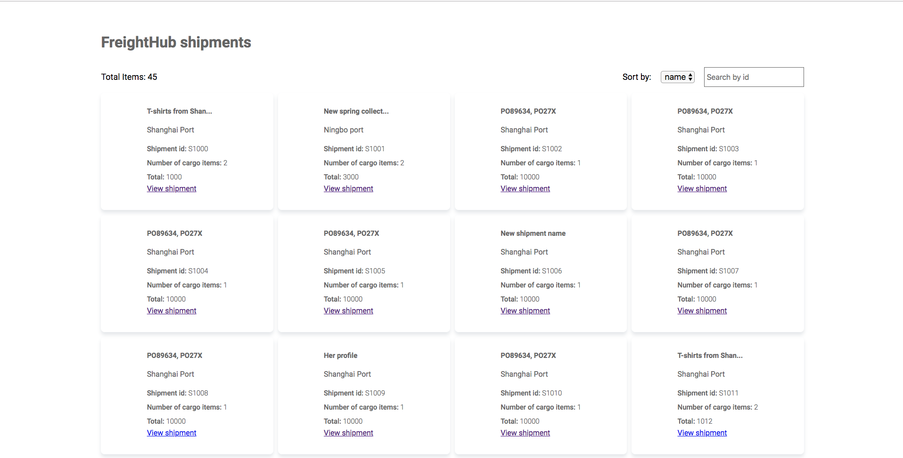

# FreightHub Frontend Coding Challenge
The main goal of this app is to allow the user to check the shipments at a glance. This allows users to take faster decisions and plan ahead of time.

Providing information to the customer increases transparency and reduces communication issue.



This app has the following features:
===

- The user should be able to see shipments in pages of 20 elements per page.
- The user should be able to search for shipment id and sort by different fields.
- The user should be able to see the shipment information on a shipment details page
- The user should be able to update the shipment name

# Technology stack
1. ReactJS
2. MobX
3. Typescript
4. json-server
5. Sass
6. Webpack

# Steps to install

- Clone this repository
```
git clone https://github.com/freight-hub/freighthub-frontend-challenge.git
```
- Install dependencies
```
yarn install
```
- Start the application in development mode

```
yarn start:dev
```

- Run production build
```
yarn test
```

Have fun!
